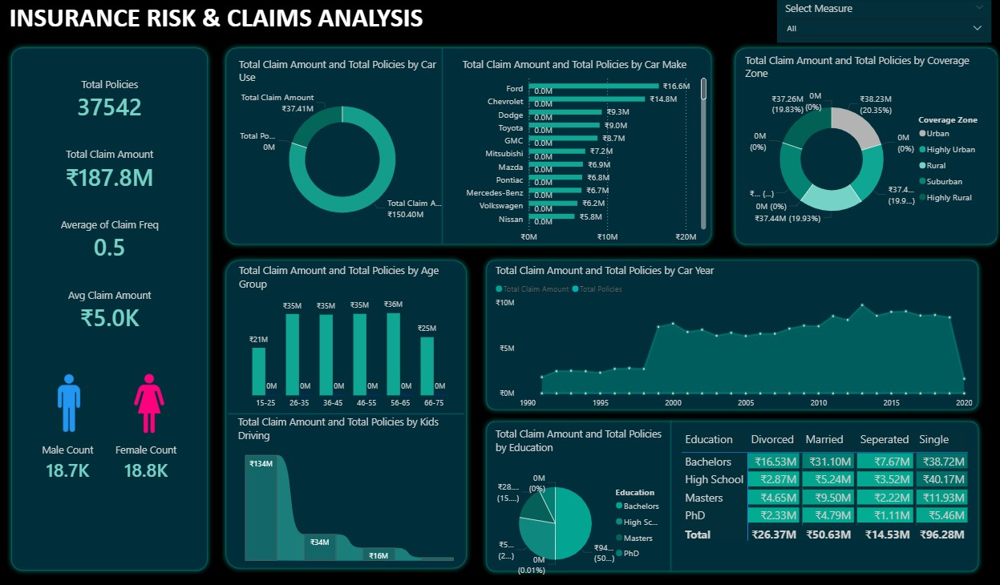

# 📊 Insurance-Risk-Claims-Analysis  

## 📝 Overview  
This project explores insurance policies, claims, and risk patterns to uncover valuable insights for decision-making. Using **Power BI**, I built an interactive dashboard to visualize policyholder trends, claims distribution, and risk assessment. The analysis helps identify patterns in customer claims, track policy performance, and support better risk management strategies.  

## ✨ Key Features  
- 🔍 **Policy Insights** – Explore different types of policies and their performance.  
- 📈 **Claims Analysis** – Identify trends in claims frequency and amounts.  
- ⚖️ **Risk Evaluation** – Assess high-risk areas and customer segments.  
- 📊 **Interactive Dashboard** – Use filters and slicers to drill down into details.  

## ✅ Dataset Information  
- **insurance_policies_data.xlsx** used as the main dataset.  
- Contains details about policies, customers, and claims.  
- Data was cleaned and structured to remove duplicates, null values, and ensure consistency.  
- Provides meaningful insights into risk and claim management.  

## 🛠️ Tools Used  
- **Power BI** – Designed interactive visualizations for claims and policy analysis.  
- **Excel** – Used for dataset cleaning, validation, and preprocessing.  

## 🚀 How to Use  
1. Open `Insurance Dashboard.pbix` in **Power BI Desktop**.  
2. Explore insights using filters, slicers, and drill-through features.  
3. Review claim trends, policyholder data, and risk metrics.  

## 🗂️ File Structure  
- `insurance_policies_data.xlsx`: Dataset with insurance policy and claims data.  
- `Insurance Dashboard.pbix`: Power BI visualization file.  
- `README.md`: Documentation.  

## 📊 Power BI Dashboard  
  

## 🤝 How to Contribute  
If you’d like to suggest improvements:  
- 🍴 Fork this repository.  
- 🛠️ Create a feature branch.  
- 📬 Submit a pull request with your changes.  

---

👉 This project highlights **data analysis and visualization skills** using Power BI, focusing on risk and claim management. It’s useful for insurance companies to improve decision-making and customer satisfaction.  
